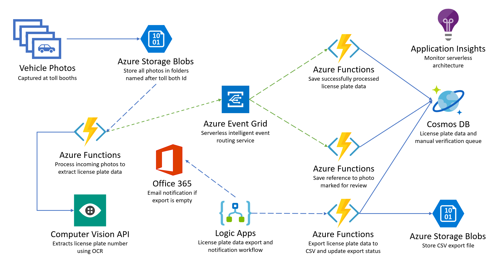

# Serverless architecture

Litware, Inc. is rapidly expanding their toll booth management business to operate in a much larger area. As this is not their primary business, which is online payment services, they are struggling with scaling up to meet the upcoming demand to extract license plate information from a large number of new tollbooths, using photos of vehicles uploaded to cloud storage. Currently, they have a manual process where they send batches of photos to a 3rd-party who manually transcodes the license plates to CSV files that they send back to Litware to upload to their online processing system. They want to automate this process in a way that is cost effective and scalable. They believe serverless is the best route for them, but do not have the expertise to build the solution.

## Target Audience

Application Developers

## Abstract

### Workshop

In this workshop, you will work as a group to setup and configure a serverless architecture within Azure using a combination of Azure Functions, Logic Apps, Event Grid, Cosmos DB, and Azure Storage. The focus is on removing server management from the equation, breaking down the solution into smaller components that are individually scalable, and allowing the customer to only pay for what they use.

Learning Objectives:

- Use a series of Azure Functions that independently scale and break down business logic to discrete components.

- Use computer vision algorithms within an Azure Function to accurately detect license plates in car images at scale.

- Provision and use Cosmos DB as a highly available NoSQL data store for processed data.

- Create a Logic App that contains a workflow to export processed license plates and conditionally send alerts based on successful or unsuccessful operation.

- Use App Insights to monitor the serverless topology, observing how well the solution scales when under load.

- Implement a Continuous Deployment DevOps process to automatically publish changes to Function Apps.

### Whiteboard Design Session

In this whiteboard design session, you will work with a group to design a solution for processing vehicle photos as they are uploaded to a storage account, using serverless technologies on Azure. The license plate data needs to be extracted and stored in a highly available NoSQL data store for exporting. The data export process will be orchestrated by a serverless Azure component that coordinates exporting new license plate data to file storage and sending notifications as needed. You will also configured a Continuous Deployment process to automatically publish new changes to Function Apps. Finally, the entire processing pipeline will need to be monitored, with particular attention paid to components scaling to meet processing demand.

### Hands-on Lab

The Serverless architecture hands-on lab is an exercise that will challenge you to implement an end-to-end scenario using a supplied sample that is based on Microsoft Azure Functions, Azure Cosmos DB, Event Grid, and related services. The scenario will include implementing compute, storage, workflows, and monitoring, using various components of Microsoft Azure. The hands-on lab can be implemented on your own, but it is highly recommended to pair up with other members at the lab to model a real-world experience and to allow each member to share their expertise for the overall solution.

## Azure services and related products

- Azure Functions
- Azure Cognitive Services
- Azure Event Grid
- Application Insights
- AzureCosmos DB
- Logic Apps

## Azure solution

Below is a diagram of the solution architecture you will build in this lab. Please study this carefully, so you understand the whole of the solution as you are working on the various components.

The solution begins with vehicle photos being uploaded to an Azure Storage blobs container, as they are captured. A blob storage trigger fires on each image upload, executing the photo processing **Azure Function** endpoint (on the side of the diagram), which in turn sends the photo to the **Cognitive Services Computer Vision API OCR** service to extract the license plate data. If processing was successful and the license plate number was returned, the function submits a new Event Grid event, along with the data, to an Event Grid topic with an event type called "savePlateData". However, if the processing was unsuccessful, the function submits an Event Grid event to the topic with an event type called "queuePlateForManualCheckup". Two separate functions are configured to trigger when new events are added to the Event Grid topic, each filtering on a specific event type, both saving the relevant data to the appropriate **Azure Cosmos DB** collection for the outcome, using the Cosmos DB output binding. A **Logic App** that runs on a 15-minute interval executes an Azure Function via its HTTP trigger, which is responsible for obtaining new license plate data from Cosmos DB and exporting it to a new CSV file saved to Blob storage. If no new license plate records are found to export, the Logic App sends an email notification to the Customer Service department via their Office 365 subscription. **Application Insights** is used to monitor all of the Azure Functions in real-time as data is being processed through the serverless architecture. This real-time monitoring allows you to observe dynamic scaling first-hand and configure alerts when certain events take place.

## Related references

[MCW](https://github.com/Microsoft/MCW)
