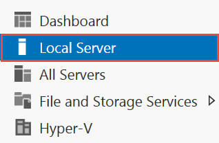
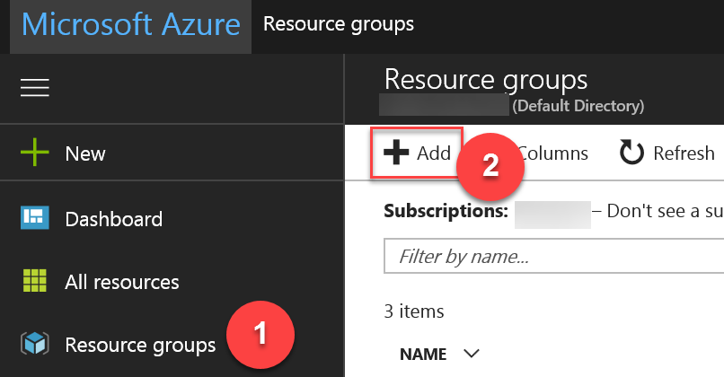
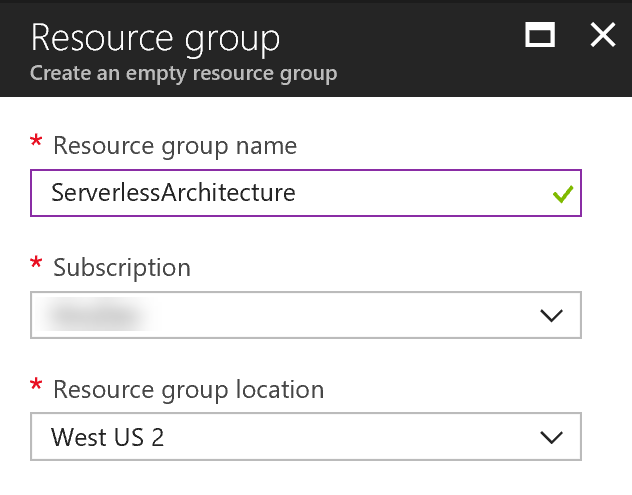

# Serverless Architecture setup

## Requirements

1.  Microsoft Azure subscription (non-Microsoft subscription)

2.  Local machine or a virtual machine configured with (**complete the day before the lab!**):

    a.  Visual Studio Community 2017 or greater, **version 15.4** or later

        i.  <https://www.visualstudio.com/vs/>

    b.  Azure development workload for Visual Studio 2017

        ii. <https://docs.microsoft.com/azure/azure-functions/functions-develop-vs#prerequisites>

    c.  .NET Framework 4.7 runtime (or higher)

        iii. <https://www.microsoft.com/net/download/windows>

3.  Office 365 account. If required, you can sign up for an Office 365 trial at:

    a.  <https://portal.office.com/Signup/MainSignup15.aspx?Dap=False&QuoteId=79a957e9-ad59-4d82-b787-a46955934171&ali=1>

4.  GitHub account. You can create a free account at <https://github.com>.

## Before the hands-on lab

**Duration**: 10 minutes

In this exercise, you will set up your environment you will use for the rest of the exercises. This will involve downloading the sample application and creating your Azure resource group for the lab.

### Task 1: Set up a development environment

If you do not have a machine with Visual Studio Community 2017 (or greater) and the Azure development workload, complete this task.

1.  Create a virtual machine (VM) in Azure using the Visual Studio Community 2017 on Windows Server 2016 (x64) image. A Windows 10 image will work as well.

    

Note: It is highly recommended to use a DS2 or D2 instance size for this VM.

### Task 2: Disable IE Enhanced Security

Note: Sometimes this image has IE ESC disabled. Sometimes it does not.

1.  On the new VM you just created, select the **Server Manager** icon.

    

2.  Select **Local Server**.

    

3.  On the right side of the pane, select **On** by **IE Enhanced Security Configuration**.

    

4.  Change to **Off** for Administrators and select **OK**.

    

### Task 3: Validate connectivity to Azure

1.  From within the virtual machine, launch Visual Studio and validate that you can log in with your Microsoft Account when prompted.

2.  To validate connectivity to your Azure subscription, launch Visual Studio, open **Server Explorer** from the **View** menu, and ensure that you can connect to your Azure subscription.

    

### Task 4: Download and explore the TollBooth starter solution

1.  Create a new folder on your C: drive named **Hackathon**.

2.  Download the sample application from here: <http://bit.ly/2D0uo6z> and extract to the **Hackathon** folder. You will need to copy and paste the URL into your browser, as Ctrl+Click does not honor casing in the URL.

Note: The link above is case sensitive.

3.  From the **TollBooth** folder under **Hackathon**, open the Visual Studio Solution file: **TollBooth.sln**.

    The solution contains the following projects:

  TollBooth      The TollBooth Azure Function App project
  -------------- -------------------------------------------------------------------------------------------------------------------------------------
  UploadImages   Local console project for uploading either a handful of car photos, or 1,000 for testing scalability of the serverless architecture

4.  Go back to the Hackathon folder and open the **license plates** subfolder. It contains sample license plate photos used for testing out the solution. One of the photos is guaranteed to fail OCR processing, which is meant to show how the workload is designed to handle such failures. The **copyfrom** folder is used by the UploadImages project as a basis for the 1,000 photo upload for testing scalability.

### Task 5: Create a new Azure Resource group

1.  Within the Azure Management Portal, open the **Resource groups** tile and\
    select **Add**.

    

2.  Specify the name of the resource group as **ServerlessArchitecture**, and choose the Azure region to which you want to deploy the lab. This resource group will be used throughout the rest of the lab. Select **Create** to create the resource group.

    
